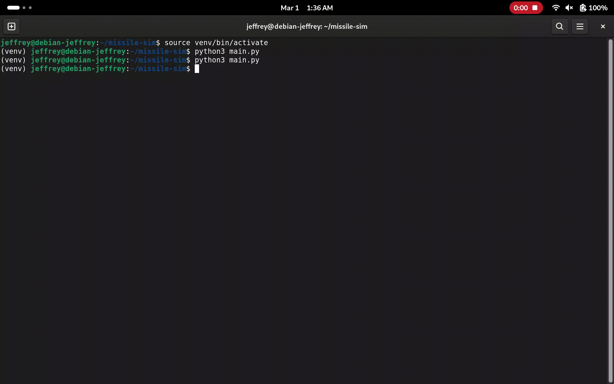

# Missile Simulator



## How to run

1. Create the virtual environment

```sh
python3 -m venv venv/
```

2. Activate the virtual environment

```sh
source venv/bin/activate
```

3. Install dependencies

```sh
pip install -r requirements.txt
```

4. Run the program

```sh
python3 main.py
```
